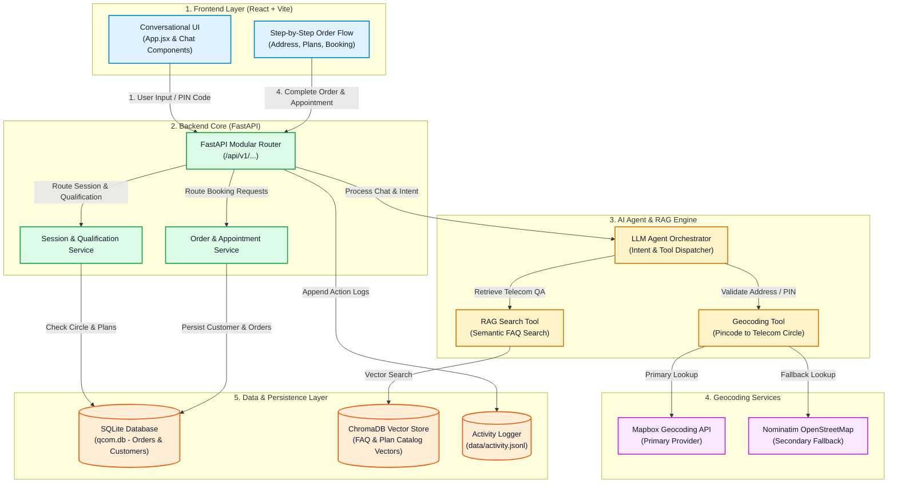

# 📐 Qcom Signal Selector — Technical System Architecture

**Signal Selector** is an enterprise-grade broadband connected intelligence platform built with a React (Vite) frontend, FastAPI backend core, LLM tool orchestration, dual-geocoding fallback engine (Mapbox + OpenStreetMap), and vector-based RAG support.

---

## 🎨 System Architecture Diagram

---

## 🔍 Layer Component Breakdown

### 1. Frontend Layer (`/frontend`)
- **Technology**: React 19, Vite, Tailwind CSS, Custom CSS (`wizard.css`, `wizard-overrides.css`).
- **`App.jsx`**: Main state management and conversational interface renderer.
- **Components**: `CustomerCard`, `QuickActions`, `PlanCards`, `AppointmentScheduler`.

### 2. Backend Core (`/app`)
- **Framework**: FastAPI with standard JSON envelopes (`success`, `code`, `message`, `data`).
- **APIRouters**: Modular router registry (`/api/v1/session`, `/qualification`, `/recommendation`, `/customers`, `/appointments`, `/payments`, `/orders`, `/assistant`).

### 3. AI Agent & RAG Engine (`/app/chat`, `/app/rag`)
- **Agent Orchestrator**: Intent handling, out-of-domain query guardrails, and tool dispatching.
- **Geocoding Tool**: Enforces 6-digit Indian pincode validation and resolves regional telecom circles.
- **RAG Retriever**: Queries ChromaDB vector embeddings over FAQ catalogs for grounded answers.

### 4. External Geocoding Services
- **Primary**: Mapbox API.
- **Secondary Fallback**: Nominatim OpenStreetMap with compliant custom user-agent header.

### 5. Persistence Layer (`/data`, `qcom.db`)
- **SQLite (`qcom.db`)**: Persistent tables for customer profiles, plans, appointments, and orders.
- **ChromaDB (`chroma_data/`)**: Vector embeddings store.
- **Activity Log (`data/activity.jsonl`)**: Line-delimited JSON log capturing session activity, query inputs, and order bookings.
