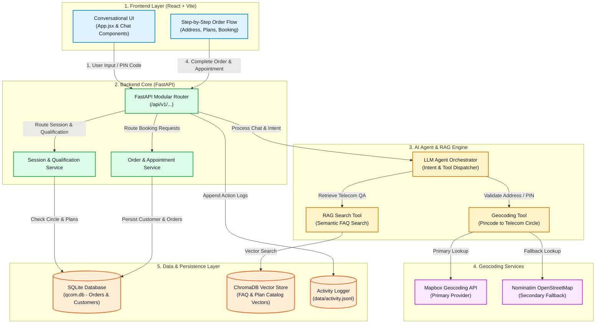

# Qcom Signal Selector — Broadband Connected Intelligence Platform

[](https://fastapi.tiangolo.com/)
[](https://reactjs.org/)
[](https://vitejs.dev/)
[](https://tailwindcss.com/)
[](https://python.langchain.com/)

**Signal Selector** is an enterprise-grade broadband selection and serviceability qualification engine powered by FastAPI, OpenStreetMap (Nominatim) geocoding, Retrieval-Augmented Generation (RAG), and a React frontend.

---

## 📐 System Architecture

The system architecture and data flow of **Signal Selector** is detailed in [ARCHITECTURE.md](./ARCHITECTURE.md) and illustrated below:


<details>
<summary><b>Click to view interactive Mermaid flowchart code</b></summary>


</details>

---

## 📁 Repository Structure

```text
Qcom-Signal_Selector/
├── frontend/                     # React (Vite) + Tailwind CSS Conversational Interface
│   ├── src/
│   │   ├── App.jsx               # Main Conversational Flow & UI Components
│   │   ├── main.jsx              # React Entry Point
│   │   ├── styles.css            # Base & Layout Styles
│   │   ├── wizard.css            # Plan Cards & Wizard Styling
│   │   └── wizard-overrides.css  # Customized Component Overrides
│   ├── package.json              # Frontend Dependencies
│   └── vite.config.js            # Vite Configuration
├── backend/                      # FastAPI Backend Application
│   ├── app/                      # Application Package
│   │   ├── api/                  # API Routers (Session, Qualification, RAG, Order, etc.)
│   │   ├── chat/                 # State Graph & Tool Calling Logic
│   │   ├── models/               # SQLAlchemy Models
│   │   ├── rag/                  # Retriever & Knowledge Base Search
│   │   ├── schemas/              # Pydantic Schemas & Response Envelopes
│   │   ├── services/             # Address, Plan, Appointment, and Order Services
│   │   └── main.py               # FastAPI Application Core & Routes
│   ├── main.py                   # Backend Script Launcher
│   └── requirements.txt          # Python Dependencies
├── data/                         # Persistent Data Layer
│   ├── activity.jsonl            # Customer Sessions, Queries & Booking Action Logs
│   ├── plans_catalog.json        # Regional Telecom Plans & OTT Bundles Catalog
│   └── seed.py                   # Seed Script for Address & Plan DB
├── requirements.txt              # Root Python Dependencies
├── package.json                  # Root Workspace Orchestration
└── README.md                     # Project Documentation
```

---

## ⚡ Key Features

1. **OpenStreetMap (Nominatim) Integration**:
   - Geocodes 6-digit Indian PIN codes and street addresses into exact telecom circles (Delhi NCR, Mumbai, Bengaluru, Hyderabad, Chennai, Kolkata, AP & Telangana, etc.).
   - Employs a compliant custom `User-Agent`: `SignalSelectorTelecomApp/1.0 (contact: dev@prodapt.com)`.

2. **LLM Agent & Tool Calling Architecture**:
   - `validate_and_check_serviceability(pincode)`: Handles natural language PIN extractions, enforces strict 6-digit validation, and returns circle availability.
   - `get_regional_plans(circle_id, address)`: Serves regional fiber tariffs and OTT packages.
   - `rag_knowledge_search(query)`: Performs semantic retrieval over `activity.jsonl` and `plans_catalog.json` for hallucination-free QA.
   - **Guardrails**: Politely declines out-of-domain topics (gym, food, clothes, sports) and steers users back to telecom services.

3. **Strict Conversational Flow**:
   - Step 1: Pincode Verification -> Unlocks structured Address Form.
   - Step 2: Address Submission -> Renders interactive Plan Cards exclusively (no plain-text plan dumps).
   - Step 3: Plan Selection & Booking -> Explicit action triggers Appointment Scheduler with dynamic future calendar picker and clean time slots (`10:00 AM - 12:00 PM`, `03:00 PM - 04:00 PM`).

4. **Line-Delimited Activity Logs**:
   - Records session starts, pincode checks, address geocodes, queries, and order bookings in `data/activity.jsonl`.

---

## 🛠️ Quick Start & Installation

### 1. Backend Setup

```bash
# Navigate to repository root or backend folder
cd backend

# Create and activate virtual environment (optional)
python -m venv venv
# On Windows:
venv\Scripts\activate
# On Linux/macOS:
source venv/bin/activate

# Install dependencies
pip install -r requirements.txt

# Start FastAPI server
uvicorn app.main:app --reload --port 8000
```

- **Root Status Endpoint**: GET `http://localhost:8000/` -> `{"status": "online", "message": "Signal Selector API is running"}`
- **Interactive API Documentation (Swagger)**: GET `http://localhost:8000/docs`

### 2. Frontend Setup

```bash
# Navigate to frontend folder
cd frontend

# Install dependencies
npm install

# Start Vite development server
npm run dev
```

- Open `http://localhost:5173` in your browser to interact with the application.

---

## 🧪 Testing & Verification

1. **Verify Root Health Route**:
   ```bash
   curl http://localhost:8000/
   ```
   *Expected Output:* `{"status":"online","message":"Signal Selector API is running"}`

2. **Test Address Qualification API**:
   ```bash
   curl -X POST http://localhost:8000/api/v1/qualification/address \
     -H "Content-Type: application/json" \
     -d '{"session_id":"test-session","pincode":"110001"}'
   ```

3. **Test Interactive Flow in UI**:
   - Enter pincode `110001` or `560001`.
   - Submit address details in the form.
   - Select a plan from the UI Plan Cards.
   - Pick an installation date & time slot.
   - Complete booking & simulate payment.

---

## 📄 License

This repository is maintained for the **Signal Selector** project. 
